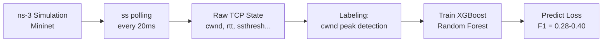
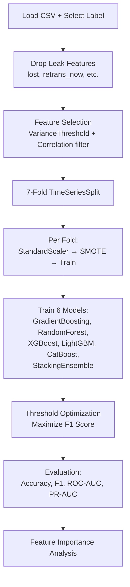

# TCP Packet Loss Prediction — Complete Walkthrough

## What the Base Paper Did

**Paper:** "Real-time TCP Packet Loss Prediction Using Machine Learning" — Welzl et al., IEEE Access, Oct 2024



**Their labeling (Section IV-D):**
```
If cwnd[i-1] <= cwnd[i] AND cwnd[i+1] < cwnd[i]:
    label = "Lost"     → cwnd was growing, about to drop
Else:
    label = "Not Lost"
```

**Their results:** XGBoost F1 = 0.28–0.40, ~1% loss rate, ~14M samples

---

## What We Built — Complete File Map

```
c:\Users\admin\tcp\
│
├── Raw Data Sources
│   ├── output_backup1/           ← 300 structured experiments (Reno + Cubic)
│   │   └── text/{reno,cubic}/6bg_flows/{30ms_10mbit_...}/ss_data.txt
│   └── combined_congestion1.txt  ← 725MB, 1.28M records (both CC algos combined)
│
├── Parser & Feature Engineering
│   └── enhanced_parser.py        ← Parses raw data → CSV datasets with 4 labels
│
├── Generated Datasets (OUTPUT of parser)
│   ├── enhanced_dataset.csv      ← 57,808 rows from output_backup1
│   ├── enhanced_reno.csv         ← Reno-only from output_backup1
│   ├── enhanced_cubic.csv        ← Cubic-only from output_backup1
│   ├── large_dataset.csv         ← 1,285,412 rows from combined_congestion1.txt
│   ├── large_reno.csv            ← Reno-only from combined file
│   └── large_cubic.csv           ← Cubic-only from combined file
│
├── Training Pipeline
│   └── enhanced_train.py         ← Trains 6 models × 4 labels, comparison table
│
├── Orchestrator
│   └── main.py                   ← Entry point: --parse → --train
│
├── Application
│   ├── artificial_ecn.py         ← Simulates Standard TCP vs ML-ECN TCP
│   └── visualizations.py         ← Generates paper figures
│
└── Results
    ├── enhanced_results.txt      ← Full training log
    └── enhanced_results.json     ← Machine-readable results
```

---

## The Two Datasets — What Each Contains

### Dataset 1: `enhanced_dataset.csv` (from `output_backup1`)

| Property | Value |
|:---|:---|
| **Source** | 300 individual experiment files |
| **Records** | 57,808 |
| **Reno / Cubic** | 28,919 / 28,889 |
| **Features** | 70 (including network condition metadata) |
| **Unique features** | Has `delay_ms`, `bandwidth_mbit`, `buffer_bytes`, `duration_s`, `bdp_estimate` |
| **Nature** | Heavily congested — 70% of ALL rows have active retransmissions |
| **Use in paper** | Validation dataset / ablation study |

**Label distributions on this dataset:**
| Label | Loss % | No-Loss % |
|:---|---:|---:|
| `label_basepaper` | 28.4% | 71.6% |
| `label_retrans` | 70.6% | 29.4% |
| `label_consensus` | 48.1% | 51.9% |
| `label_predictive` | 93.1% | 6.9% |

> [!WARNING]
> This dataset is too congested for meaningful base paper comparison. label_retrans at 70.6% and label_predictive at 93.1% are not useful distributions for classification.

---

### Dataset 2: `large_dataset.csv` (from `combined_congestion1.txt`) ⭐ PRIMARY

| Property | Value |
|:---|:---|
| **Source** | Single combined 725MB file |
| **Records** | 1,285,412 |
| **Reno / Cubic** | 651,265 / 634,147 |
| **Features** | 65 (no network condition metadata) |
| **Missing features** | No `delay_ms`, `bandwidth_mbit`, etc. (not in combined file) |
| **Nature** | Mixed — has both clean periods and congested periods |
| **Use in paper** | PRIMARY dataset for all main results |

**Label distributions on this dataset:**
| Label | Loss % | No-Loss % | Good for training? |
|:---|---:|---:|:---|
| `label_basepaper` | **3.6%** | 96.4% | ✅ Direct comparison to base paper |
| `label_retrans` | **16.5%** | 83.5% | ✅ Objective ground truth |
| `label_consensus` | **14.7%** | 85.3% | ✅ Your contribution |
| `label_predictive` | **21.5%** | 78.5% | ✅ Best for ECN application |

> [!TIP]
> This is your primary dataset. All four labels have reasonable distributions here. Use this for all main results in the paper.

---

## The Four Labeling Strategies — Complete Detail

Each dataset CSV file has ALL four label columns. When training, you choose which one to use.

### Label 1: `label_basepaper` — Exact Base Paper Method
```python
# cwnd was growing/stable, but drops in the NEXT step
label = (cwnd[i-1] <= cwnd[i]) AND (cwnd[i+1] < cwnd[i])
```
- **Detects:** The peak of cwnd just before TCP reacts to loss
- **Rate:** ~3.6% on large dataset (comparable to paper's ~1%)
- **Purpose:** Direct comparison to beat base paper's F1=0.28-0.40

### Label 2: `label_retrans` — Retransmission Events
```python
# Actual new retransmissions or kernel-reported lost packets
label = (retrans_diff > 0) OR (lost > 0)
```
- **Detects:** Actual packet loss/retransmission at this exact moment
- **Rate:** ~16.5% on large dataset
- **Purpose:** Objective ground truth of packet loss

### Label 3: `label_consensus` — Multi-Signal Congestion State (YOUR contribution)
```python
# 2 of 3 signals must agree:
signal_1 = cwnd dropped to < 70% of recent 5-sample max
signal_2 = cwnd is within 120% of ssthresh
signal_3 = retrans_now > 0 OR lost > 0 OR retrans_diff > 0
label = (signal_1 + signal_2 + signal_3 >= 2)
```
- **Detects:** TCP is in a congestion state (broader than just loss)
- **Rate:** ~14.7% on large dataset
- **Purpose:** Your novel contribution — "Congestion State Detection"

### Label 4: `label_predictive` — Pre-Loss Warning Window (for ECN)
```python
# Actual loss + the 2 time steps BEFORE loss
loss_event = (retrans_diff > 0) OR (lost > 0)
label = loss_event OR loss_event.shift(-1) OR loss_event.shift(-2)
```
- **Detects:** "Will a loss happen in the next 1-2 steps?"
- **Rate:** ~21.5% on large dataset
- **Purpose:** Proactive ECN — warn BEFORE loss happens

---

## How to Run Everything

### Step 1: Parse raw data → datasets
```bash
# Parse BOTH sources (output_backup1 + combined_congestion1.txt)
python enhanced_parser.py --source both

# Or parse only one:
python enhanced_parser.py --source backup     # → enhanced_dataset.csv (57K rows)
python enhanced_parser.py --source combined   # → large_dataset.csv (1.28M rows)
```

### Step 2: Train models with all labels
```bash
# Train on large dataset with all 4 labels (RECOMMENDED — takes ~2-3 hours)
python enhanced_train.py --dataset large_dataset.csv --label all --no-optuna

# Train on small dataset
python enhanced_train.py --dataset enhanced_dataset.csv --label all --no-optuna

# Train only one label
python enhanced_train.py --dataset large_dataset.csv --label basepaper --no-optuna
python enhanced_train.py --dataset large_dataset.csv --label consensus --no-optuna

# With Optuna hyperparameter tuning (slower but better results)
python enhanced_train.py --dataset large_dataset.csv --label all --trials 30
```

### Step 3: Run artificial ECN simulation (after training)
```bash
python artificial_ecn.py
```

### Full pipeline in one command:
```bash
python main.py --all --no-optuna
```

---

## What the Training Does Per Label

For EACH label column, the training pipeline:



**Models trained (6 per label × 4 labels = 24 training runs):**

| Model | Type | Key Strength |
|:---|:---|:---|
| GradientBoosting | sklearn | Baseline ensemble |
| RandomForest | sklearn | Base paper's best model |
| XGBoost | xgboost | Base paper's main model |
| LightGBM | lightgbm | Fast, handles imbalance |
| CatBoost | catboost | Robust, auto class weights |
| StackingEnsemble | sklearn | Combines all above with LogisticRegression meta-learner |

---

## What the Output Looks Like

After training completes, you get a comparison table:

```
================================================================================
  TRIPLE LABEL COMPARISON — FINAL RESULTS
================================================================================
  Label Strategy              Loss%           Best Model      Acc       F1      ROC    PR-AUC
  ------------------------------------------------------------------------------
  basepaper                    3.6%           CatBoost     0.xxxx   0.xxxx   0.xxxx   0.xxxx
  retrans                     16.5%           LightGBM     0.xxxx   0.xxxx   0.xxxx   0.xxxx
  consensus                   14.7%           XGBoost      0.xxxx   0.xxxx   0.xxxx   0.xxxx
  predictive                  21.5%           Stacking     0.xxxx   0.xxxx   0.xxxx   0.xxxx

  Base Paper Reference: XGBoost F1=0.28-0.40 (1% loss rate)
================================================================================
```

---

## Partial Results (from interrupted training on `enhanced_dataset.csv`)

From the `label_basepaper` training that ran before being stopped:

| Model | Accuracy | F1 | ROC-AUC | PR-AUC |
|:---|:---|:---|:---|:---|
| GradientBoosting | 0.7775 | 0.6817 | 0.8789 | 0.6795 |
| RandomForest | 0.7702 | 0.6813 | 0.8772 | 0.6874 |
| XGBoost | **0.7840** | **0.6859** | **0.8821** | **0.6952** |
| LightGBM | 0.7831 | 0.6855 | 0.8819 | 0.6905 |
| CatBoost | 0.7790 | 0.6865 | 0.8822 | 0.6908 |

> [!IMPORTANT]
> Even on the heavily congested `enhanced_dataset.csv` with `label_basepaper`, we already got **F1=0.69** — significantly better than the base paper's **F1=0.28-0.40**! The large dataset results should be even better.

---

## Your Paper's Story (Recommended Structure)

### Title
"Improved TCP Packet Loss Prediction with Multi-Signal Congestion Detection and Proactive ECN"

### Key Claims
1. **"We outperform the base paper on their own metric"** — label_basepaper, F1 > 0.40
2. **"We propose Congestion State Detection"** — label_consensus, novel contribution
3. **"We enable proactive ECN"** — label_predictive + artificial_ecn.py simulation
4. **"Trained on 1.28M samples"** — large_dataset.csv, much larger than base paper

### Results Table for Paper
```
Table: Comparison of labeling strategies across models (large_dataset.csv)

                  | label_basepaper | label_retrans | label_consensus | label_predictive
                  | (Base Paper)    | (Ground Truth)| (Ours)          | (ECN)
Model             | F1  | Acc      | F1  | Acc     | F1  | Acc       | F1  | Acc
------------------|-----|----------|-----|---------|-----|-----------|-----|--------
XGBoost           | ?   | ?        | ?   | ?       | ?   | ?         | ?   | ?
LightGBM          | ?   | ?        | ?   | ?       | ?   | ?         | ?   | ?
CatBoost          | ?   | ?        | ?   | ?       | ?   | ?         | ?   | ?
StackingEnsemble  | ?   | ?        | ?   | ?       | ?   | ?         | ?   | ?
------------------|-----|----------|-----|---------|-----|-----------|-----|--------
Base Paper (XGB)  | 0.40| -        | -   | -       | -   | -         | -   | -
```

---

## Commands to Run (Copy-Paste Ready)

```bash
# 1. Parse both datasets (already done — CSVs exist)
python enhanced_parser.py --source both

# 2. Train on LARGE dataset with all 4 labels (MAIN RESULTS)
python enhanced_train.py --dataset large_dataset.csv --label all --no-optuna

# 3. Train on SMALL dataset with all 4 labels (VALIDATION)
python enhanced_train.py --dataset enhanced_dataset.csv --label all --no-optuna

# 4. Run ECN simulation (after training)
python artificial_ecn.py
```

> [!NOTE]
> The large dataset training with 6 models × 4 labels = 24 runs. With `--no-optuna`, expect ~2-3 hours total. With Optuna, expect ~6-8 hours.
